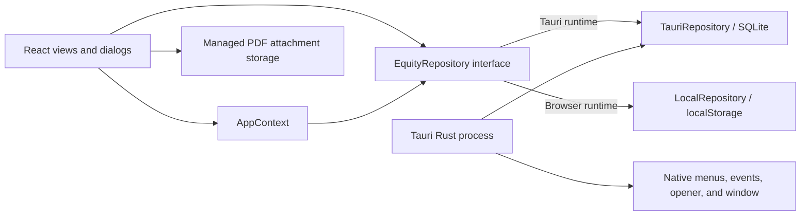
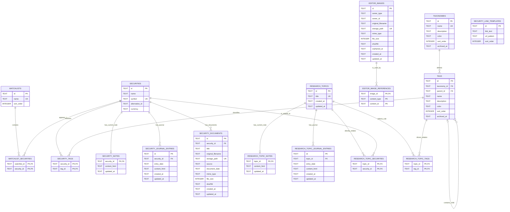

# EquityJournal Technical Documentation

This document describes the current EquityJournal implementation. It reflects database migrations `001` through `007` and the application structure at the time of writing.

## 1. System overview

EquityJournal is a local-first desktop application for retail investment research. Its main capabilities are:

- managing securities and ordered watchlists;
- maintaining hierarchical taxonomies and assigning securities to tags;
- writing a current investment thesis and dated journal entries for securities;
- attaching and organizing PDF research documents for securities;
- writing current notes and dated journal entries for research topics;
- relating topics directly to securities or dynamically through taxonomy tags;
- configuring external security links and security-list columns; and
- exporting visible security-table data as CSV or HTML through the clipboard or a native file dialog;
- filtering All Securities and watchlists in memory by symbol or company name;
- navigating between securities and topics through references embedded in rich text.

The production application is a Tauri desktop process with a React frontend and a local SQLite database. A browser-only development mode replaces SQLite with a `localStorage` repository that implements the same application-facing contract.

## 2. Technology stack

| Area | Technology |
| --- | --- |
| Desktop shell | Tauri 2 |
| Native layer | Rust 2021 |
| Frontend | React 19 and TypeScript |
| Build tooling | Vite 8 |
| UI components | BlueprintJS 6 and Lucide icons |
| Rich-text editing | Tiptap 3 / ProseMirror |
| Desktop persistence | SQLite through `@tauri-apps/plugin-sql` |
| Browser development persistence | Web `localStorage` |
| Tests | Vitest, jsdom, and Testing Library |

## 3. High-level architecture



### Frontend responsibilities

- `src/app/App.tsx` selects the current view, owns top-level dialogs, and manages sidebar resizing.
- `src/app/AppContext.tsx` initializes the repository, loads application-wide collections, stores navigation history, and exposes mutations followed by refreshes.
- `src/components/` contains views, forms, dialogs, the taxonomy tree, drag-and-drop behavior, journals, and the rich-text editor.
- `src/domain/types.ts` defines application entities and view types.
- `src/data/repository.ts` defines the persistence boundary and shared input validation.
- `src/data/tauriRepository.ts` implements the repository with SQL.
- `src/data/localRepository.ts` implements the same contract with in-memory objects persisted to browser storage.
- `src/utils/securityDocumentStorage.ts` manages PDF bytes independently of document metadata.

### Native responsibilities

`src-tauri/src/lib.rs`:

- registers and runs SQLite migrations;
- installs the SQL and URL-opener plugins;
- creates the native application, Edit, and View menus;
- forwards theme and settings menu events to the frontend; and
- exposes commands for database-path configuration metadata.

## 4. Persistence model

### Desktop mode

`TauriRepository.initialize()` loads:

```text
sqlite:equity-journal.sqlite3
```

The Tauri SQL plugin resolves this relative database URL in the application's data area. Foreign-key enforcement is explicitly enabled for each repository connection with:

```sql
PRAGMA foreign_keys = ON;
```

Migrations are embedded in the Rust binary and registered with the SQL plugin. An already-released migration must never be edited because the plugin validates the checksum of previously applied migrations. Schema changes must be added as a new, incrementally numbered migration and registered in `src-tauri/src/lib.rs`.

### Browser development mode

When `window.__TAURI_INTERNALS__` is absent, `createRepository()` selects `LocalRepository`. Its complete data model is serialized under:

```text
equity-journal.development-database.v1
```

This data is independent of the desktop SQLite database and is intended for browser UI development only.

### Database-path setting limitation

The Settings dialog can read and save a path through Rust commands, but that path is not currently supplied to `Database.load()`. Therefore, changing the configured path does **not** change the database used by the running application. The copy helper also derives an `equity-journal.db` default path while the active repository URL uses `equity-journal.sqlite3`. These parts must be unified before custom database locations can be considered supported.

## 5. Entity-relationship diagram

The following diagram represents the effective SQLite schema after migration `008_editor_images.sql`.



`SECURITY_LINK_TEMPLATES` is intentionally independent: templates are global application configuration rather than records belonging to individual securities.

## 6. Entity behavior and invariants

### Securities

- IDs are UUID strings generated in the frontend.
- Symbols are normalized to uppercase and are unique case-insensitively.
- Currency values are normalized to uppercase.
- `alternative_id` is optional at the domain level and stored as an empty string when absent.
- “All Securities” is a virtual application view, not a row in `watchlists`.

Deleting a security cascades to watchlist membership, tag assignments, its current note, journal entries, document metadata, and direct topic relationships. The application also removes that security's managed attachment directory. A security dynamically related to a topic through a tag disappears from that topic automatically when its tag assignment is removed.

### Watchlists

- Names are unique case-insensitively.
- `sort_order` controls sidebar ordering.
- Membership is represented by `watchlist_securities`.
- Deleting a watchlist deletes only its membership rows; it never deletes securities.

### Taxonomies and tags

- A taxonomy owns zero or more tags.
- `tags.parent_id` creates an arbitrarily deep hierarchy.
- Parent deletion uses `ON DELETE CASCADE`, which allows deleting a taxonomy and its complete tag tree safely.
- The application prevents moving a tag into itself or one of its descendants.
- Tag names are unique case-insensitively among siblings, including a separate uniqueness rule for root tags.
- `sort_order` stores sibling order. Reordering or reparenting a tag rewrites the affected sibling positions.
- A security can be assigned to any number of tags through `security_tags`.

The taxonomy editor builds an in-memory tree by combining tags with assigned securities. Searching is also performed against this tree model without a database query.

### Current notes and journals

Securities and research topics each support two complementary note forms:

- a single current note, stored one-to-zero-or-one with its owner; and
- dated journal entries, stored one-to-many.

Journal dates use `YYYY-MM-DD`. Each owner may have at most one entry on a particular date. Rich text is persisted as HTML, while creation and update timestamps use ISO-8601 strings.

Managed note images can be inserted from the editor toolbar, by dropping files, or by pasting screenshots. Persisted HTML contains `data-equity-journal-image-id` references rather than image bytes or absolute paths. `editor_images` stores managed-file metadata, while `editor_image_references` records which current note or journal entry uses each image.

Every successful note save rebuilds that content record's image references from its HTML. Images without references receive an `orphaned_at` timestamp; referencing them again clears it. Startup cleanup deletes managed files that have remained orphaned for seven days and then removes their metadata, providing a grace period for undo and interrupted edits. Deleting a security or topic removes its image metadata immediately and removes the owner's complete managed attachment directory.

### Security documents

Each security can have any number of PDF research documents. The SQLite table stores searchable metadata only: title, source, optional report date, original filename, managed relative path, size, MIME type, hash, and timestamps. It deliberately has no document-type field.

Desktop PDF and image bytes default to the application's data directory under `attachments/`. PDFs use `securities/{security-id}/`, while note images use `securities/{security-id}/images/` or `topics/{topic-id}/images/`. The Documents section in Settings can select another absolute attachment root. Saving a changed location copies the managed `securities` and `topics` trees to the new root before switching the configuration, then removes the old managed trees. The setting is stored separately from the SQLite database configuration in `document-storage.json`.

SQLite retains only relative paths such as `securities/{security-id}/{document-id}.pdf`, which keeps database records valid when the root changes and avoids storing large binary values in SQLite. Paths created by the first attachment implementation with an `attachments/` prefix remain supported. SHA-256 uniqueness per security prevents attaching the same PDF twice. Browser development mode mirrors file storage in IndexedDB because the browser repository itself uses `localStorage`.

The Documents tab supports multi-file selection, PDF drag and drop, in-memory metadata search, editing title/source/report date, opening, revealing in Finder or Explorer, and deletion. Deleting an attachment removes both its managed file and metadata row.

### Research topics and related securities

A topic can relate to securities through both mechanisms at once:

1. `research_topic_securities` stores explicit security selections.
2. `research_topic_tags` stores dynamic tag rules.

Dynamic rules use “selected tag and all descendant tags” semantics. Multiple selected tags are combined with match-any behavior. `TauriRepository.getResearchTopicRelations()` resolves descendants through a recursive SQLite CTE, unions direct and dynamic sources, and reports whether each result is direct, dynamic, or both.

### External security links

Each global link template contains display text, a URL pattern, and a display order. Supported placeholders are:

- `{SYMBOL}`
- `{ALTERNATIVE_ID}`

Only HTTP and HTTPS patterns are accepted. A link requiring `{ALTERNATIVE_ID}` is hidden for a security whose alternative ID is empty. Templates can also be exposed as configurable columns in security tables.

## 7. Repository boundary

All persistent operations are defined by the `EquityRepository` interface. Components should use this interface rather than importing a concrete repository. This keeps UI behavior testable and maintains parity between desktop and browser development modes.

The main operation groups are:

- security CRUD;
- watchlist CRUD, ordering, and membership;
- taxonomy/tag CRUD, hierarchy ordering, and security assignments;
- current notes, dated journals, and security-document metadata;
- external link templates; and
- topic CRUD, notes, journals, and related-security rules.

Shared validation such as required text, journal dates, link placeholders, and URL protocols lives in `src/data/repository.ts`.

## 8. Application state and navigation

`AppProvider` owns the application-wide lists of securities, watchlists, taxonomies, link templates, and research topics. After a mutation it refreshes these collections through the repository.

Views are represented as a discriminated union:

- all securities;
- a watchlist;
- research-topic list;
- research-topic details;
- taxonomy editor; or
- security details.

Navigation history is held in memory and capped at 50 entries. The back button returns to the previous application view rather than delegating to browser history.

The following UI preferences are stored in browser/webview `localStorage`, including in desktop mode:

| Key | Purpose |
| --- | --- |
| `equity-journal.theme` | Dark, light, or system theme |
| `equity-journal.recent-securities` | Up to five recently opened security IDs |
| `equity-journal.security-display-mode` | Symbol first, company first, or company only |
| `equity-journal.sidebar-width-v2` | Sidebar width |
| `equity-journal.visible-security-columns` | Security-table column visibility and order |

## 9. Rich-text storage and references

The Tiptap editor supports paragraph and heading blocks, common inline formatting, lists, links, highlights, tables, undo, and redo. The toolbar is sticky within long note views.

Internal links are stored inside the note HTML as atomic spans with stable identifiers:

```html
<span
  data-equity-journal-reference
  data-reference-type="security"
  data-reference-id="..."
  data-reference-label="..."
></span>
```

`data-reference-type` is either `security` or `topic`. Clicking a reference saves through the optional pre-navigation hook before opening the target view. The stored label is presentation data; navigation relies on the stable type and ID.

## 10. Drag-and-drop behavior

The app uses pointer-driven drag-and-drop rather than the browser HTML drag API.

- Securities can be dragged from security tables onto watchlists in the sidebar. Command-click on macOS or Ctrl-click on other platforms toggles individual rows, while Shift-click selects a contiguous range in the displayed order. All selected securities can be dragged together.
- Securities can be moved between taxonomy tags.
- Holding Option on macOS or Ctrl on other supported desktop platforms copies a tag assignment instead of moving it.
- Tags can be reordered, reparented, or moved to the taxonomy root.
- Drop targets are derived from elements under the pointer and receive explicit visual feedback.

Persistence still occurs through repository methods; the tree and table layers do not issue SQL directly.

## 11. Native integration and security

The Tauri capability file grants the main window access to core APIs, SQL load/select/execute operations, the opener, native open/save dialogs, reading user-selected PDF sources, and writing a user-selected export file. Managed attachment operations use narrow Rust commands that resolve validated relative paths beneath the configured document root; configuring an arbitrary folder therefore does not require granting the webview access to the entire home directory. The content security policy allows only local application content, Tauri IPC, inline styles needed by the UI, and local/data images.

The native Edit menu restores standard Undo, Redo, Cut, Copy, Paste, and Select All behavior. The View menu controls the theme, while the application menu opens Settings. Native browser context menus are suppressed outside editable elements; inputs and rich-text editing surfaces retain appropriate platform behavior.

## 12. Important source locations

| Path | Purpose |
| --- | --- |
| `src/app/App.tsx` | Top-level layout and view selection |
| `src/app/AppContext.tsx` | Global state, refresh, preferences, and navigation |
| `src/domain/types.ts` | Domain and view types |
| `src/data/repository.ts` | Repository contract and shared validation |
| `src/data/tauriRepository.ts` | SQLite implementation |
| `src/data/localRepository.ts` | Browser-development implementation |
| `src/components/RichTextEditor.tsx` | Tiptap editor and internal references |
| `src/components/TaxonomyView.tsx` | Taxonomy editor UI |
| `src/components/taxonomyTreeModel.ts` | Taxonomy tree construction and filtering |
| `src/components/useTaxonomyDragAndDrop.ts` | Taxonomy pointer drag-and-drop state machine |
| `src/components/ResearchJournal.tsx` | Shared security/topic journal UI |
| `src/components/SecurityDocuments.tsx` | Security document library UI and metadata editor |
| `src/utils/securityDocumentStorage.ts` | Native/browser PDF storage, opening, reveal, and cleanup |
| `src-tauri/src/lib.rs` | Tauri setup, native menus, commands, and migrations |
| `src-tauri/migrations/` | Ordered SQLite schema migrations |
| `src/styles/global.css` | Application layout and base styles |
| `src/styles/blueprint-overrides.css` | BlueprintJS theming and compact component rules |

## 13. Development, verification, and packaging

Install dependencies and run the desktop development application:

```sh
npm install
npm run tauri dev
```

Run only the browser frontend with the `localStorage` repository:

```sh
npm run dev
```

Run automated tests and create a frontend production bundle:

```sh
npm test
npm run build
```

Create installable desktop bundles:

```sh
npm run tauri build
```

For a release, keep the version synchronized in `package.json`, `src-tauri/Cargo.toml`, and `src-tauri/tauri.conf.json`.

## 14. Schema-change checklist

When adding or changing persistent data:

1. Add a new SQL file under `src-tauri/migrations/`; never modify an applied migration.
2. Register the new version in the migration list in `src-tauri/src/lib.rs`.
3. Update domain types in `src/domain/types.ts`.
4. Extend `EquityRepository` as needed.
5. Implement equivalent behavior in both `TauriRepository` and `LocalRepository`.
6. Preserve foreign-key cascade behavior and add indexes for foreign keys or common ordering/filter paths.
7. Add repository and UI tests.
8. Run `npm test`, `npm run build`, and, for native changes, `cargo check` or `npm run tauri build`.
9. Update this document and its ER diagram.
